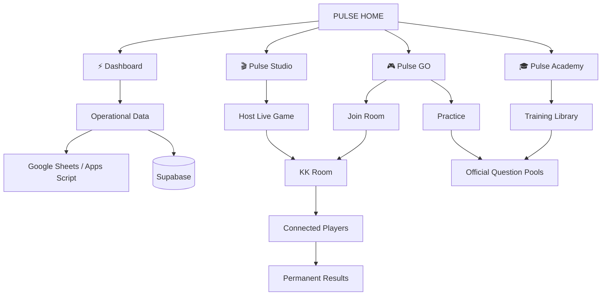

<div align="center">

# ⚡ PULSE

### Performance intelligence, interactive training, and operational knowledge for Kampaign Kings.

[](https://pulse-kk.com)


<br />


<br />

**One ecosystem. Four connected experiences.**

`Dashboard` · `GO` · `Academy` · `Studio`

</div>

---

## What is Pulse?

**Pulse** is the internal performance and training ecosystem built for **Kampaign Kings**.

It combines live operational data, agent performance intelligence, interactive games, official training material, supervisor tools, and permanent game results inside one connected platform.

Pulse is designed for:

- Team leaders
- Supervisors
- Quality Assurance
- Trainers
- Managers
- Kampaign Kings agents

> Pulse is an internal Kampaign Kings product and is not intended for public redistribution.

---

## The Pulse ecosystem

| ⚡ Pulse Dashboard | 🎮 Pulse GO |
|---|---|
| Live performance intelligence for leaders and supervisors. | Interactive practice and multiplayer training for agents. |
| Team metrics, agent data, rankings, profiles, analytics, goals, historical performance, and operational monitoring. | Practice mode, live rooms, team selection, languages, game modes, difficulty levels, room codes, scoring, and final results. |

| 🎓 Pulse Academy | 🎬 Pulse Studio |
|---|---|
| The official Kampaign Kings training and knowledge library. | The control center for hosts, supervisors, trainers, and QA. |
| Scripts, objections, product knowledge, call flow, QA rules, invalid transfers, dispositions, dialer guides, roleplays, and common mistakes. | Host live games, review results, access reports, and expand future training tools from one premium workspace. |

---

# ⚡ Pulse Dashboard

Pulse Dashboard is the performance intelligence layer of the platform.

It provides leaders with a clear view of current and historical production across Kampaign Kings teams.

### Core capabilities

- Live agent transfer metrics
- English, Spanish, invalid, and total transfer tracking
- Team-level performance summaries
- Daily, weekly, monthly, and historical views
- Agent rankings and Top Performers
- Team rankings
- Goal tracking
- Agent profiles
- Search by agent name or extension
- Historical snapshots
- CSV and report exports
- Supervisor and administrative tools
- Persistent data for reporting and analysis
- Responsive layouts for desktop, tablet, and mobile

### Supported teams

- Philippines
- Venezuela
- Colombia
- Mexico BJ
- Central America
- Asia

---

# 🎮 Pulse GO

Pulse GO transforms Kampaign Kings training into an interactive experience.

Agents can practice independently or join live rooms hosted by supervisors and trainers.

### Agent experience

- Practice mode
- Join Room with a `KK` code
- Language selection
- English questions
- Spanish questions
- Mixed-language questions
- Game selection
- Difficulty selection for Classic Quiz
- Immediate answer feedback
- Explanations after each question
- Score and accuracy tracking
- Final performance summary

### Host experience

- Create live rooms
- Select the participating team
- Select language
- Select game mode
- Select difficulty where applicable
- Share room codes
- View connected players
- Start synchronized games
- Follow player progress
- View live and final leaderboards
- Open permanent results URLs

### Current game modes

| Game | Purpose |
|---|---|
| **Classic Quiz** | Official Pulse questions separated by difficulty. |
| **Valid or Invalid XFER** | Decide whether a transfer should count. |
| **Objection Battle** | Select the strongest response to an objection. |
| **Dispose It** | Choose the correct call disposition. |
| **Eligible or Not Eligible** | Review vehicle and customer eligibility. |
| **Certification Mode** | Complete a more demanding final assessment. |

### Game results

Every completed live game can produce a permanent result page containing:

- Team
- Language
- Selected game
- Difficulty when applicable
- Player ranking
- Score
- Accuracy
- Correct and missed answers
- Top Performers
- Low Performers
- Full participant results

Example route:

```text
/go/results/KKXXXX
```

---

# 🎓 Pulse Academy

Pulse Academy is the official Kampaign Kings learning and operational knowledge center.

It gives agents and leaders one organized place to understand processes, prepare for training, and correct performance issues.

### Academy library

- Welcome and platform guidance
- Official scripts
- Objection handling
- Product knowledge
- Call flow
- QA and Invalid XFER rules
- Dispositions
- Dialer Guide
- Roleplays
- Common mistakes

### Academy experience

- English and Spanish content
- Search across training topics
- Quick-access learning cards
- Detailed topic pages
- Sidebar navigation
- Page-specific navigation
- Responsive training content
- Connections between Academy material and Pulse GO practice

---

# 🎬 Pulse Studio

Pulse Studio is the premium workspace for the people running training.

It separates host and supervisor tools from the simplified Pulse GO agent experience.

### Available tools

- Host a Game
- Open final results
- Search by `KK` room code
- Launch the official Pulse GO host flow
- Navigate between Pulse, GO, Studio, and Academy

### Studio roadmap

- Custom Game Builder
- Audio Audit training
- Official Question Bank management
- Expanded reports
- Supervisor and QA utilities
- Custom training content
- Additional live-game controls

---

## Platform architecture



---

## Main routes

| Route | Experience |
|---|---|
| `/` | Pulse landing page |
| `/signin` | User sign in |
| `/register` | User registration |
| `/dashboard` | Main performance dashboard |
| `/profile/:ext` | Agent profile |
| `/go` | Pulse GO agent landing |
| `/go/quiz` | GO configuration flow |
| `/go/quiz/play` | Practice game |
| `/go/quiz/:code` | Live room |
| `/go/results/:code` | Permanent final results |
| `/studio` | Pulse Studio |
| `/academy` | Pulse Academy |
| `/academy/:id` | Academy topic detail |

---

## Technology

### Frontend

- React
- JavaScript
- Vite
- React Router
- Modular CSS
- Responsive desktop, tablet, and mobile layouts

### Data and services

- Supabase
- Google Sheets
- Google Apps Script
- Browser storage for selected local session data
- Real-time and persisted Pulse GO room data

### Reporting and exports

- ExcelJS
- FileSaver
- CSV and spreadsheet exports

### Deployment

- GitHub
- Vercel
- Production domain: [pulse-kk.com](https://pulse-kk.com)

---

## Project structure

```text
pulse-dashboard/
├── public/
│   ├── audio/
│   ├── emojis/
│   ├── flags/
│   └── training/
│
├── src/
│   ├── components/
│   ├── go/
│   │   ├── GoLanding.jsx
│   │   ├── GoQuiz.jsx
│   │   ├── GoQuizPlay.jsx
│   │   ├── GoQuizRoom.jsx
│   │   ├── GoQuizResults.jsx
│   │   ├── GoLearn.jsx
│   │   ├── GoLearnDetail.jsx
│   │   └── Studio.jsx
│   │
│   ├── pages/
│   │   ├── Landing.jsx
│   │   ├── Dashboard.jsx
│   │   ├── Profile.jsx
│   │   ├── Admin.jsx
│   │   ├── Settings.jsx
│   │   ├── SignIn.jsx
│   │   └── Register.jsx
│   │
│   ├── utils/
│   ├── App.jsx
│   ├── config.js
│   ├── index.css
│   └── main.jsx
│
├── package.json
├── vite.config.js
└── vercel.json
```

---

## Local development

### Requirements

- Node.js
- npm
- Git

### Clone and install

```bash
git clone https://github.com/Moonky1/pulse-dashboard.git
cd pulse-dashboard
npm install
```

### Start the development server

```bash
npm run dev
```

Open:

```text
http://localhost:5173
```

### Production build

```bash
npm run build
```

### Preview the production build

```bash
npm run preview
```

### Run ESLint

```bash
npm run lint
```

---

## Environment variables

Create a local `.env` file when required.

```env
VITE_SUPABASE_URL=your_supabase_project_url
VITE_SUPABASE_ANON_KEY=your_supabase_publishable_or_anon_key
```

Never commit production secrets, service-role keys, passwords, or private credentials.

---

## Development workflow

Before pushing changes:

```bash
npm run build
npm run dev
```

Verify the affected routes locally, then commit only the files related to the change:

```bash
git status
git add path/to/changed-file
git commit -m "Describe the change"
git push
```

Avoid using `git add .` without checking `git status` first.

---

## Design language

Pulse uses a unified cinematic interface across its public experiences:

- Deep navy backgrounds
- Soft blue illumination
- Glass-style surfaces
- Pixel-inspired game assets
- Large Sora typography
- Compact navigation pills
- Animated visual details
- Shared branding across Home, GO, Studio, and Academy
- Responsive layouts adapted for desktop, tablet, and mobile

The objective is to make an internal operations platform feel fast, premium, recognizable, and engaging.

---

## Current status

| System | Status |
|---|---|
| Pulse Dashboard | 🟢 Active |
| Pulse GO Practice | 🟢 Active |
| Pulse GO Live Rooms | 🟢 Active |
| Permanent Results | 🟢 Active |
| Pulse Academy | 🟢 Active |
| Pulse Studio | 🟢 Active |
| Custom Game Builder | 🟡 Planned |
| Audio Audit Training | 🟡 Planned |
| Question Bank Management | 🟡 Planned |

---

## Ownership

This project was designed and developed for **Kampaign Kings**.

The repository, platform logic, operational data, training content, visual identity, and internal workflows are intended for authorized Kampaign Kings use.

<div align="center">

---

### Built with precision for Kampaign Kings.

**PULSE**

*Performance intelligence for leaders. Training that agents actually want to use.*

[Open Pulse](https://pulse-kk.com)

</div>
