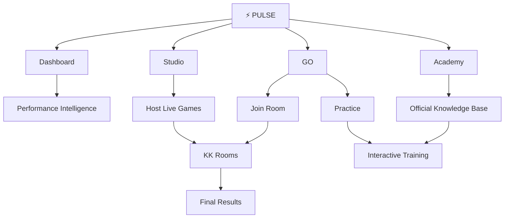

<div align="center">

# ⚡ PULSE

### Performance, training, and knowledge for Kampaign Kings.

[](https://pulse-kk.com)


**Dashboard · GO · Studio · Academy**

</div>

---

## About Pulse

Pulse is an internal platform created for **Kampaign Kings**.

It connects performance tracking, interactive training, operational knowledge, and supervisor tools through four unified experiences:

- **Pulse Dashboard** — performance insights, rankings, profiles, and team analytics.
- **Pulse GO** — practice games, live rooms, scoring, and final results.
- **Pulse Studio** — tools for hosting games and managing training experiences.
- **Pulse Academy** — official scripts, processes, QA guidance, and training content.

---

## Platform architecture



---

## Technology

- React
- Vite
- JavaScript
- React Router
- Supabase
- Vercel

---

## Local development

```bash
git clone https://github.com/Moonky1/pulse-dashboard.git
cd pulse-dashboard
npm install
npm run dev
```

Production build:

```bash
npm run build
```

---

<div align="center">

### Built for Kampaign Kings

[Open Pulse](https://pulse-kk.com)

</div>
